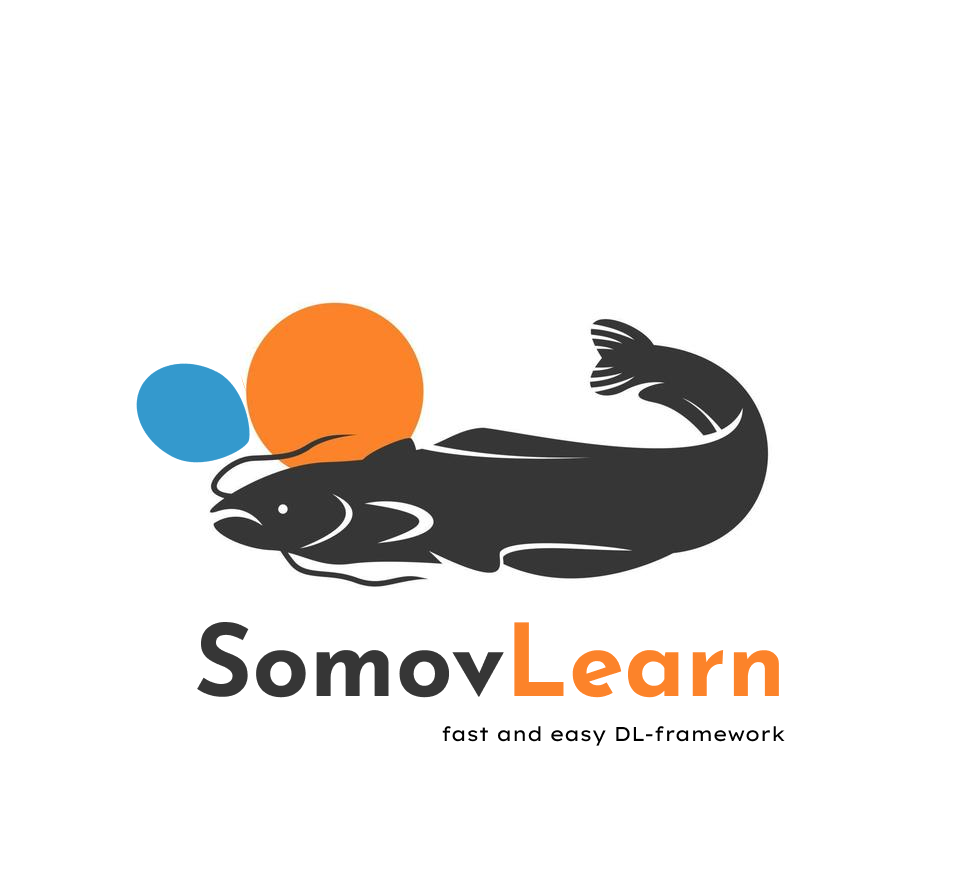
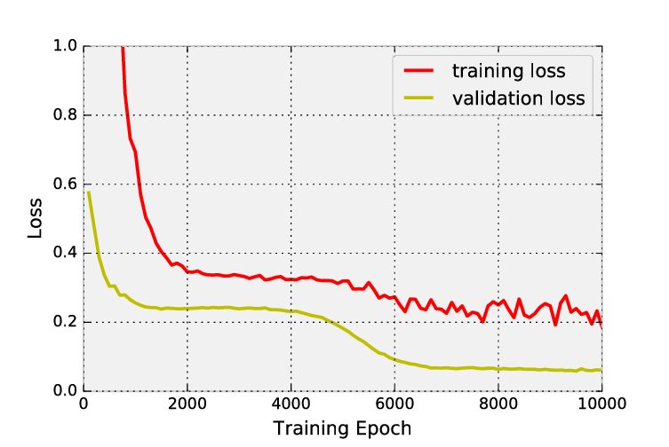
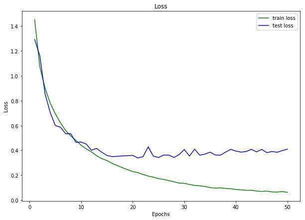

# somovlearn



Somovlearn is the one of the fastest and easiest DL-libraries in the World. Just prove it by yourself!


## Quick dive into SVLearn:
* [ Installation ](#inst)
* [ Quickstart ](#quick)
* [ Why fast? ](#fast)
* [ Features ](#feat)
* [ Contribution ](#contrib)

<a name="inst"></a>
## Installation

SVLearn could be installed by running the following command through pip: 

`pip install git+https://github.com/MakhmoodSodikov/somovlearn.git`


<a name="quick"></a>
## Quickstart

To start using Somov, just import main objects:

```python
from somovlearn.activations import Sigmoid
from somovlearn.layers import DenseLayer
from somovlearn.pipeline import Pipeline
from somovlearn.optim import AdaGrad
from somovlearn.loss import MSELoss
from somovlearn.data import Dataloader
```

First DL-pipeline could be created just by few lines of code:

```python
pipe = Pipeline()
pipe.add(DenseLayer(input_size=1024, output_size=10, l1_regularization=True))
pipe.add(Sigmoid())
```

Then you should initialize Optimizer:

```python
optimizer = AdaGrad(lr=0.01, momentum=0.9)
```

Choose your Loss function:

```python
loss = MSELoss()
```

Then pick your data:

```python
x_train, y_train, x_test, y_test = DataLoader(seed=42).load_cifar10()
```

And finally, compile your pipeline and run training process:

```python
pipe.compile(optimizer=optimizer
             loss=loss)

pipe.train(features_train=x_train, 
           targets_train=y_train, 
           features_test=x_test,
           targets_test=y_train,
           visualize=True)
```

Your training process will be visualised in real-time:





<a name="fast"></a>
## Why fast?

SVLearn uses [dynamic computation graph](https://ai.stackexchange.com/questions/3801/what-is-a-dynamic-computational-graph) to compile DL models. That's why your experiments are flexible and fast. 

But on the other hand, you can vary hyperparameters and other dependencies inplace, with no need to recompile

<a name="feat"></a>
## Features
One of the interesting and useful features of SVLearn v1.0.1 is the SmartCast technology, which makes your code possible to work with wide variety of Data Sctructures, such as numpy.array (ndarray), torch.Tensor and even Python list!

Other opportunity, which is provided by SVLearn, is the Automatic training process visualization. You can visualize charts, model weights and even hyperparameters dependencies. Just try it by yourself.

<a name="contrib"></a>
## Contribution

This library is under the MIT Common License and known as Open-Source project, so any other developer could contribute.

To contribute just follow the specifications and SVLearn's architecture standards and feel free to create new PRs.
